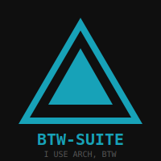

# 🚀 btw-suite: The Ultimate Arch Ascension 🚀

[](https://opensource.org/licenses/MIT)
[](https://archlinux.org)
[](#)

> "I use Arch, btw." — Every Chad ever.

Welcome to **btw-suite**, a collection of high-performance, aesthetic, and "chad-tier" scripts designed to elevate your Arch Linux (or CachyOS/Artix) experience to godhood.

---

## 🛠️ Features

- **`rank-mirrors`**: A supremacist mirror ranking script using `rate-mirrors`.
  - Prioritizes Canada 🇨🇦, US 🇺🇸, and Worldwide 🌎.
  - Optimized for both throughput (large packages) and latency (small packages).
  - Supports Arch, CachyOS, and Artix.
  - Automated via systemd timers.
- **Aesthetic CLI**: Powered by `lib/chad.sh` for maximum visual dominance.
- **Systemd Integration**: Set it and forget it.

---

## 📦 Installation

```bash
git clone https://github.com/Nsomnia/btw-suite.git
cd btw-suite
# Installation script coming soon...
```

---

## 🚀 Usage

### Mirror Ranking

```bash
sudo ./scripts/rank-mirrors.sh
```

---

## 🎨 Aesthetic



---

## 📜 License

MIT. Because freedom matters. (Stallman would be proud... maybe).

---

<p align="center">
  Made with ❤️ and ☕ by a Chad who uses Arch, btw.
</p>
